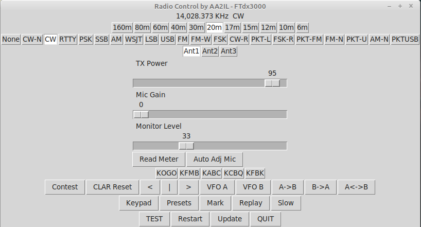

# FTDX

Gui for configuring and controlling a rig.

There are programs out there that do a much better job of this.  I mainly used this as an excuse to learn Python/Tk.  Also, this functionality has been folded into pyKeyer and pySDR so I don't use it much these days.
